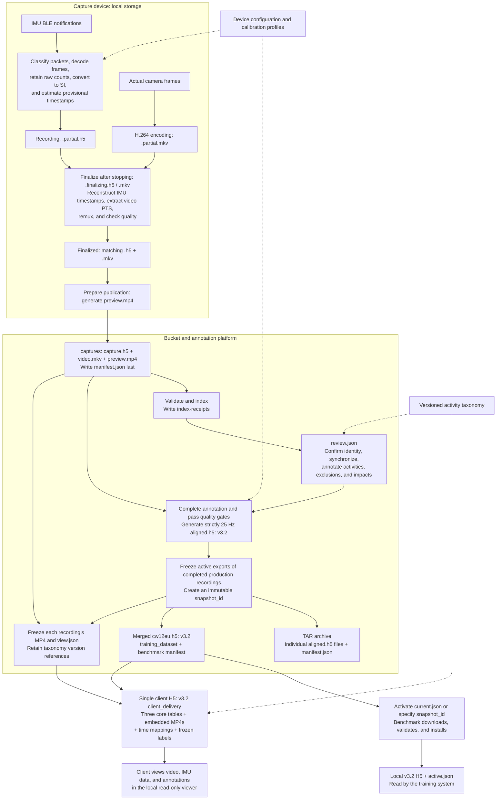

# Project Data Pipeline and Stored File Formats

[中文](data-pipeline.zh-CN.md) | English

This document describes the complete production CW12EU-T pipeline, from BLE packets to training data and client delivery, based on the repository code and data contracts as of 2026-09-10. Stored artifacts include local files, server caches, and bucket objects.

**The original capture H5 preserves evidence. The `aligned.h5` generated when annotation is completed already uses v3.2. Snapshot creation packages these files into a TAR archive and merges them into `cw12eu.h5` for training. The client version adds video, time mappings, and label names from the same snapshot.**

## 1. Overall data flow

Solid arrows show data flow; dotted arrows show configuration or version references needed to interpret the data. The TAR archive and merged H5 organize the same set of individual recording exports in two different ways.



## 2. From IMU packets to local files

### 2.1 Packet preprocessing

The BLE callback first records the host monotonic time in nanoseconds and preserves the complete notification bytes, then parses them using the device protocol. A CW12EU-T notification may contain multiple **16-byte frames**: the first 12 bytes contain six big-endian signed `int16` values, ordered as three accelerometer axes followed by three gyroscope axes. The remaining four bytes are preserved unchanged as `trailer`, without assigning an unverified meaning.

The `packet_kind` codes are `1` for sample packets, `2` for known auxiliary status packets, and `255` for unknown invalid packets. Known 10-byte auxiliary packets retain their payload but produce zero samples, do not participate in timestamp fitting, and do not count as parse failures. Unknown invalid packets are retained as evidence and block production publication.

SI conversion follows the frozen device profile: **subtract biases in the original device axes, reorder axes and apply signs, then convert units**.

```text
Acceleration (m/s²)       = corrected counts after axis mapping / counts_per_g × 9.80665
Angular velocity (rad/s)  = corrected counts after axis mapping / counts_per_dps × π / 180
```

The current production CW12EU-T profile uses 4096 counts/g, 32.8 counts/(°/s), and axis signs `[+X, -Y, +Z]`. These coefficients and mappings come from versioned configuration. Raw counts remain stored separately and are never overwritten by converted values. Acceleration retains gravity and uses the sensor-local coordinate frame; this stage does not rotate to world coordinates, remove gravity, or normalize inputs for a model.

### 2.2 Intermediate states during recording and finalization

Each recording has its own directory, by default `~/IMUData/<collection_id>/<recording_id>/`, where `recording_id` is a UTC timestamp.

| Stage | Local file | Contents and state |
|---|---|---|
| Recording | `<recording_id>.partial.h5` | Appends raw notifications, six-axis counts, SI values, and provisional timestamps; reconstruction using the full recording is still pending |
| Recording | `<recording_id>.partial.mkv` | Writes H.264 video without audio, preserving actual frame timing |
| Background finalization | `<recording_id>.finalizing.h5`, `.finalizing.mkv` | Working copies for timestamp reconstruction, video probing, and remuxing; failures leave the retained partial inputs intact |
| Finalized | `<recording_id>.h5`, `.mkv` | Complete capture files; quality results separately determine publication eligibility, and a complete file is not automatically eligible for training |
| Publication preparation | `.preview.<pid>.partial.mp4` → `preview.mp4` | Remuxes MKV into browser-compatible MP4 without re-encoding; replaces the temporary file after success |

During recording, sample timestamps are estimated from each packet's receive time and the expected sampling rate. After stopping, CW12EU-T timestamps are reconstructed by fitting a line between each valid packet's cumulative last-sample index and receive time across the full recording. This produces estimated sample times, the observed sampling rate, and fitting residuals. CW12EU-T has no confirmed device sampling timestamp, so both estimated sample times and original receive times must be retained.

`recording_time_ns` is the host monotonic timestamp minus this recording's start time. Video `media_time_ns` starts at zero at the first frame. These origins may differ, so video playback time cannot be used directly as IMU time relative to the recording start.

Video finalization extracts each frame's PTS (presentation timestamp), maps it to the host monotonic clock, and remuxes the final MKV using stream copy so its media timeline starts at zero. Frame counts and intervals are checked before and after remuxing. The H5 preserves the relationship between these timelines. This stage neither duplicates video frames to force 30 FPS nor resamples IMU values to strictly 25 Hz.

The original `.partial.*` inputs are removed only after the final files and local catalog entries have been committed. Interrupted or failed partial files are recovery evidence and cannot be published directly as training data.

### 2.3 Main structure of the original capture H5

New captures currently use the `imu_capture_hdf5` schema **1.9.0**. The H5 stores video timing tables and references; video bytes remain in external MKV/MP4 files.

| H5 location | Format and purpose |
|---|---|
| Root and `imu` attributes | Recording identity, `test/prod`, clock origin, device SN, protocol, configuration and calibration references, coefficients, and evidence hashes |
| `/imu/packets/payload_values`, `payload_offsets` | A `uint8` byte stream plus `int64` offsets, allowing every original BLE notification to be reconstructed |
| Other `/imu/packets/` columns | Receive times, packet kinds, sample counts, parse status, fitted packet-end times, and residuals; times are in ns |
| `/imu/samples/raw_counts`, `trailer` | Six-axis `int16 [N,6]` counts and the CW12EU-T `uint8 [N,4]` trailer |
| `/imu/samples/values_si` | `float32 [N,6]` SI values; remains `NaN` without trusted calibration |
| `/imu/samples/` timing and provenance columns | Monotonic timestamps, recording-relative timestamps, time quality, packet index, and sample index within the packet |
| `/imu/connection_events` | BLE connection events and their timestamps |
| `/video/frames` | Per-frame monotonic PTS, recording-relative time, media time starting at zero, duration, and keyframe flag |
| `/sync`, `/annotations` | Initial or compatibility structures in the capture file; subsequent production annotation is governed by the separate `review.json` |
| `/experiment/stages` | Stages for characterization and similar experiments; may be empty for ordinary recordings |

The repository also supports the `acce&gyro` device under testing. Its 22-byte frame contains little-endian six-axis counts, a device-local millisecond counter, and CRLF. Its H5 additionally stores `device_time_ms` and `device_clock_epoch`. The current configuration permits only `test`; production SI calibration is unverified, so this device does not enter the production training pipeline below.

## 3. Bucket upload, synchronization, and annotation

Production `prod` recordings automatically enter the upload queue after passing finalization quality gates. `test` recordings may be published manually for integration testing but cannot produce completed training exports. Desktop clients obtain resumable upload sessions through the upload broker; management hosts may use GCS directly. Both routes produce the same object layout.

The following object paths are relative to `gs://soft3888-label/`:

| Object path | Format and contents | Mutability |
|---|---|---|
| `captures/<recording_id>/capture.h5` | Original capture HDF5, from the local recording H5 | Immutable after publication |
| `captures/<recording_id>/video.mkv` | MKV container holding the original H.264 video | Immutable after publication |
| `captures/<recording_id>/preview.mp4` | Browser video generated without re-encoding | Immutable after publication; rebuildable from MKV |
| `captures/<recording_id>/manifest.json` | Object keys, sizes, and SHA-256 for the three files, plus data tier, device, and calibration provenance | Immutable content manifest |
| `index-receipts/<recording_id>.json` | Indexing success or rejection, reason, and source manifest generation | Updatable status |
| `reviews/<recording_id>/review.json` | Current identity, assignee, synchronization, annotations, revision, and `active_export` | Mutable state protected by version checks |

Publication follows **H5 → MKV → MP4 → manifest**. The annotation service indexes a recording only after the manifest appears and checks artifact sizes and SHA-256 metadata. A successful upload means the files reached the bucket; the index receipt indicates whether the annotation service accepted them.

After claiming a task, the annotator selects and separately confirms the participant's identity using video evidence, selects synchronization anchors at the initial and final taps, and labels activity intervals, exclusions, and an impact point for each fall. Fall `onset` is derived from the corresponding fall interval's start. Activities and exclusions must fully cover the training timeline, and every fall must have one `impact` strictly inside its interval.

Production synchronization uses the shared host clock with `scale=1`. If the offsets estimated from the initial and final anchors differ by more than 100 ms, the anchors must be reselected. If they agree and the absolute mean offset is below 100 ms, no correction is applied. At or above 100 ms, a fixed offset requires explicit human confirmation. Synchronization and annotation edits update only `review.json`, leaving the original H5 and video unchanged.

Task states follow `unassigned → in_progress → completed`. Completion first generates and publishes the training H5, then updates the completed state and `active_export`. If export fails, the task remains editable. Reopening clears the active export reference; completing it again creates a new version while existing frozen snapshots retain their contents.

## 4. Producing v3.2 H5 files for training

### 4.1 A single recording: `aligned.h5`

Before exporting, the service checks `prod` eligibility, configuration authorization at capture time, trusted calibration, confirmed identity, verified synchronization, finalized annotations, and matching source hashes. It then:

1. Reads the original `raw_counts` and finalized IMU recording-relative timestamps, and recalculates SI values using the verified frozen calibration profile.
2. Adds the confirmed synchronization offset to IMU timestamps and finds the common valid interval of IMU and video data.
3. Creates a strictly 25 Hz grid at **40 ms** intervals from the start of that common interval. It linearly interpolates each axis without extrapolation and writes `float32 [N,6]` values.
4. Maps nanosecond annotations to sample indices within the sequence. Activity and exclusion boundaries and onset use ceiling; impact uses the nearest grid point, choosing the later point for an exact half-step tie.
5. Writes the three v3.2 core tables, an anonymous participant ID (`cw12eu:subject-NNN`), provenance, and a logical content digest; computes the file SHA-256 and publishes an immutable object.

The server cache filename is `aligned.h5`. Its bucket object key is:

```text
exports/<recording_id>/review-<revision>/aligned-<first_16_chars_of_logical_digest>.h5
```

Each recording corresponds to one sequence and may contain multiple activities and falls. Excluded intervals remain on the timeline as `exclude` annotations. The training reader later removes affected windows; export does not delete rows and join the data on either side of an exclusion.

This file already has `imu_schema_version=3.2.0` and `artifact_profile=training_dataset`. TAR packaging is not required to convert it to v3.2.

### 4.2 Multiple recordings: snapshots, TAR, and merged H5

Snapshot creation freezes the active exports of all currently completed `prod` recordings, checks source revisions, file SHA-256 values, and logical digests, then calculates `snapshot-<digest>` from the content, including the handoff contract version. Identical content reuses the same snapshot; subsequent annotation changes do not alter it.

| Output | Bucket object path | Contents |
|---|---|---|
| Archive of individual recordings | `training-snapshots/<snapshot_id>/cw12eu_<snapshot_id>.tar` | Uncompressed TAR containing individual v3.2 H5 files and a manifest with per-file hashes |
| Frozen video | `training-snapshots/<snapshot_id>/media/<recording_id>.mp4` | Video copied from the capture prefix, so it no longer depends on the current recording being retained |
| Frozen viewing map | `training-snapshots/<snapshot_id>/views/<recording_id>.view.json` | Source review revision, sequence position, sample zero, per-frame time mapping, annotations, and taxonomy version |
| Platform snapshot manifest | `training-snapshots/<snapshot_id>/manifest.json` | Recording set and descriptors/hashes for the TAR, videos, views, and merged H5 |
| Merged training H5 | `benchmark-datasets/team/cw12eu/<snapshot_id>/datasets/cw12eu.h5` | Concatenates the three tables from each recording, adjusting global sample ranges and sequence indices without recalibration or resampling |
| Training handoff manifest | `benchmark-datasets/team/cw12eu/<snapshot_id>/manifest.json` | H5 descriptor, versions, statistics, physical file SHA-256, and logical content SHA-256 |
| Current training pointer | `benchmark-datasets/team/cw12eu/current.json` | Snapshot ID, manifest path, and manifest hash; updated by a separate activation operation |

The TAR has the following structure. It contains individual training recordings; videos and views are separate bucket snapshot objects and are not inside this TAR:

```text
cw12eu_<snapshot_id>.tar
├── manifest.json
└── recordings/<anonymous_participant_id>/<recording_id>/aligned.h5
```

Snapshot creation publishes immutable objects first and **does not automatically advance the team's `current.json`**. Before activation, the handoff contract requires pulling and validating the explicitly named snapshot. A separate activation operation then checks object identity and atomically switches the pointer.

### 4.3 Reading data in the training system

The `imu-fall-benchmark` command `data pull` resolves `current.json` or an explicitly specified snapshot ID, downloads the merged H5, and validates its file hash, v3.2 profile, logical digest, and statistics. After validation in a local staging directory, it atomically installs:

```text
data/team/<snapshot_id>/
  datasets/cw12eu.h5
  manifest.json
data/active.json
```

Team data has already undergone unit conversion, synchronization, annotation, and resampling, so it does not pass through a public-dataset adapter. Current team data uses `evaluation_role=training_only`; the training system assigns `fold_id=-1` and includes it only in training, never in validation or test sets. Subsequent windowing and feature computation belong to the training system and do not modify these v3.2 H5 files.

## 5. Client v3.2 H5 with embedded video

A client generation job is bound to one fixed `snapshot_id`. It reads that snapshot's merged training H5, frozen MP4s, view time mappings, and referenced immutable taxonomy versions to generate one self-contained file:

```text
client-deliveries/<snapshot_id>/hdf5-v1/
  cw12eu-client-<snapshot_id>.h5
  manifest.json
  job.json
```

The generator copies the training core, embeds the original MP4 bytes for each recording, and writes time mappings and historical label names. Video is stored as contiguous, uncompressed `uint8` arrays, without splitting it into images or re-encoding it. The media index records byte lengths, physical file offsets, and a SHA-256 for each video.

After closing the file, the generator revalidates the core tables, time mappings, label references, video byte ranges, and hashes. The delivery manifest is written only after successful upload of the final H5, marking it as ready for download. The mutable `job.json` separately records queueing, generation, validation, upload, completion, or failure progress; failed jobs can be retried.

| Item | Training H5 | Client H5 |
|---|---|---|
| `imu_schema_version` | `3.2.0` | `3.2.0` |
| `artifact_profile` | `training_dataset` | `client_delivery` |
| `/samples` | `float32 [N,6]`, 25 Hz; three acceleration axes in m/s² followed by three angular velocity axes in rad/s | Identical to the corresponding snapshot's training H5 |
| `/sequences` | Compound table: sample bounds, source file, anonymous participant, recording ID, body location, activity, fall flag, supervision kind, and source sampling rate | The same sequences |
| `/annotations` | Compound table: `sequence_index`, `kind`, `start_sample`, `stop_sample`, and `code` | The same annotations |
| `/media/index`, `/media/videos/*` | Absent | One MP4 index entry and `uint8` byte array per sequence |
| `/media/timing/*` | Absent | `int64 [F,2]` with columns `recording_time_ns` and `media_time_ns` |
| `/labels/catalog`, `/labels/sequence_versions` | Absent; annotations retain stable codes | Frozen codes, names, status, and the taxonomy version assigned to each sequence |
| Main use | Benchmark training input | Local client viewing of synchronized video, IMU curves, and annotations |

Sample ranges in `/sequences` refer to the merged `/samples` table, while annotation indices in `/annotations` are relative to their own sequence. Activity and exclusion intervals use half-open ranges `[start, stop)`; onset and impact are points with `start == stop`.

The client viewer reconstructs recording time from sample zero and the 25 Hz grid, then locates video time through piecewise-linear interpolation of the per-frame timing table. It cannot simply assume a constant video frame rate. Client H5 files exclude raw BLE packets, raw counts, capture H5 files, mutable reviews, personal names, UniKeys, emails, and identity mappings. Video itself may still identify participants. The two profiles have separate official uses; client files are not added to the benchmark training catalog.

## 6. Configuration, caches, and other persisted intermediate states

These files support interpretation, recovery, and indexing. They are not additional training samples.

| Location or file | Format, purpose, and lifecycle |
|---|---|
| `device-config/v2/snapshots/<cfg-id>.json` | Immutable device configuration with protocol, sampling rate, and SI profile; approval state is in the sibling `reviews/<cfg-id>.json`, the recommended version is in `current.json`, and audit events are appended under `events/` |
| Local `device-config/workspace.json`, `local/`, and configuration cache | JSON drafts, frozen local snapshots, and verified team configuration; the capture H5 freezes the selected version and hashes |
| `configs/calibration-evidence.yaml`, `configs/device-config-bootstrap.lock.json` | Calibration evidence configuration and the packaged bootstrap lock; archived evidence is stored separately under `calibration-evidence/` as H5, video, and manifests |
| `configs/activities.yaml`; `taxonomies/<taxonomy_id>/versions/<version>.json`, `current.json` | YAML seed, immutable JSON taxonomy versions, and current taxonomy contents; exports and client deliveries use their referenced frozen versions |
| Capture-side `catalog.sqlite3` | Mutable SQLite recording catalog, quality/upload status, and persistent background jobs; does not store the IMU or video payload |
| Annotation-side `catalog.sqlite3` | SQLite index rebuildable from manifests; bucket JSON remains the source of truth for reviews |
| `catalog.sqlite3-wal`, `catalog.sqlite3-shm` | SQLite write-ahead log and shared-memory support files managed by the database at runtime; not standalone datasets |
| Server cache `objects/<sha256>/capture.h5`, `verified.json` | Verified copy of the original H5 and a marker containing object key, size, and hash; rebuildable |
| Server `exports/`, `release-inputs/`, `benchmark-snapshots/`, `training-snapshots/`, `delivery-inputs/` | Local caches for individual exports, snapshot inputs, merged H5, TAR, and client generation inputs |
| `.<filename>.<pid>.partial` during export/archive creation | Temporary H5, TAR, or JSON files for atomic writes; renamed on success and cleaned up on failure |
| Client generation cache `client-deliveries/<snapshot_id>/.<snapshot_id>.<pid>.<thread_id>.h5` | Unique temporary output; removed after validation and upload, with the published copy retained in the bucket |
| Benchmark `data/team/.<snapshot_id>.partial-<pid>/`, `data/.active.json.tmp-<pid>` | Download and local activation intermediate states; atomically replace the final directory or pointer after validation |

Version numbers belong to separate formats and are not interchangeable:

| Artifact | Version currently written |
|---|---|
| Original capture H5 | `schema_version=1.9.0` |
| Capture manifest with the new device configuration reference | `schema_version=3.2.0` |
| Review JSON | `schema_version=3.0.0` |
| Platform training snapshot manifest / manifest inside the TAR | `4.0.0` / `2.0.0`, respectively |
| Individual aligned, merged training, and client H5 | `imu_schema_version=3.2.0`, with the profile distinguishing their uses |
| Benchmark manifest / dataset handoff contract | `imu_benchmark_dataset_manifest_v2` / `dataset_handoff=1.0.0` |
| Client delivery manifest / contract | `cw12eu_client_hdf5_delivery_v1` / `1.0.0` |

The file SHA-256 validates the exact file bytes; `logical_content_sha256` identifies the logical training core content. These hashes serve different purposes. The whole H5 file hash is stored externally in manifests and object metadata, never inside the file itself. Training and client artifacts can be traced to the original recordings through snapshot IDs, source revisions, object keys, and these hashes.

## 7. Further reading

- [Data lifecycle and storage contract](data-lifecycle.md) (Chinese): workflows, snapshots, and retention. The current [service implementation](../src/imu_data_collector/annotation_service.py) defines the separation between snapshot publication and activation.
- [Device configuration Snapshot v2](device-configuration-v2.md) and [production synchronization and annotation contract](annotation-and-sync.md) (Chinese): the basis for interpreting device data and human annotations.
- [Shared HDF5 v3.2 contract](contracts/imu-hdf5-v3.2.md): complete fields, types, and physical storage constraints.
- [Annotation platform and benchmark contract](contracts/annotation-benchmark-contract.zh-CN.md) and [client delivery guide](client-delivery.md) (Chinese): the two downstream uses.
- [Packet parsing and calibration](../src/imu_data_collector/cw12eu.py), [local finalization](../src/imu_data_collector/finalization.py), [training exports and archives](../src/imu_data_collector/artifacts.py), and [client H5 generation](../src/imu_data_collector/client_hdf5.py): the corresponding processing code.

Historical `aligned30.h5` files, older schemas, and older ZIP deliveries do not represent the current pipeline. Public-dataset adapters, IMU-only characterization diagnostics, and model training details are covered in their respective documentation.
