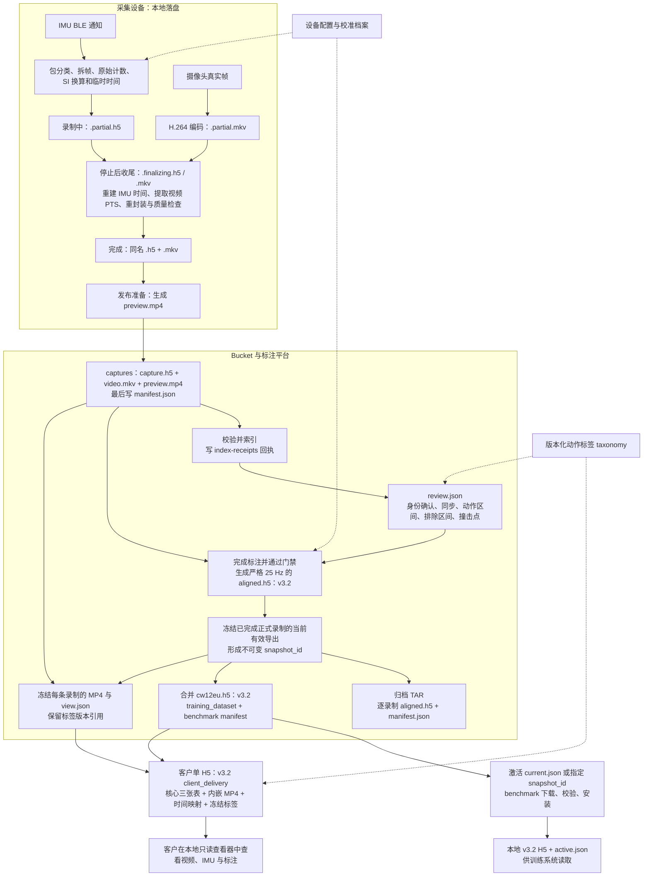

# 项目数据链路与落盘格式说明

中文 | [English](data-pipeline.en.md)

本文依据 2026-09-10 仓库代码与数据合同，说明正式 CW12EU-T 录制从 BLE 数据包到训练和客户交付的完整链路。这里的“落盘”包括本地文件、服务器缓存和 Bucket 对象。

**原始采集 H5 保存证据；标注完成时生成的 `aligned.h5` 已经是 v3.2；快照阶段把这些文件打包为 TAR，并合并为训练用 `cw12eu.h5`。客户版再从同一快照加入视频、时间映射和标签名称。**

## 1. 整体数据链路

图中实线表示数据流，虚线表示解释数据所需的配置或版本引用。TAR 与合并 H5 是同一批逐录制导出的两种组织形式。



## 2. 从 IMU 数据包到本地文件

### 2.1 数据包预处理

BLE 回调先记录主机单调时钟纳秒值，并保留整条通知的原始字节，再按设备协议解析。CW12EU-T 的一个通知可以包含多个 **16 字节帧**：前 12 字节是六个大端有符号 `int16`，依次为三轴加速度计和三轴陀螺仪计数；后 4 字节作为 `trailer` 原样保存，不猜测其含义。

通知类型 `packet_kind` 分为样本包 `1`、已知辅助状态包 `2` 和未知无效包 `255`。已知 10 字节辅助包保留 payload，但样本数为 0，不参与时间拟合，也不算解析失败；未知无效包保留证据并触发正式发布阻断。

SI 换算按冻结的设备档案执行：**先减原始轴空间的零偏，再重排轴和调整符号，最后换单位**。

```text
加速度（m/s²） = 轴映射后的校正计数 / counts_per_g × 9.80665
角速度（rad/s）= 轴映射后的校正计数 / counts_per_dps × π / 180
```

当前正式 CW12EU-T 档案使用 4096 counts/g、32.8 counts/(°/s)，轴符号为 `[+X, -Y, +Z]`。系数与轴映射来自版本化配置；原始计数另存，不被换算值覆盖。加速度保留重力，数据保持传感器局部坐标，不在此处旋转到世界坐标、去重力或做模型标准化。

### 2.2 录制中与停止后的中间态

一次录制对应一个目录，默认位置为 `~/IMUData/<collection_id>/<recording_id>/`，`recording_id` 为 UTC 时间戳。

| 阶段 | 本地文件 | 内容与状态 |
|---|---|---|
| 录制中 | `<recording_id>.partial.h5` | 持续追加原始通知、六轴计数、SI 值和临时时间；尚未完成整段时间重建 |
| 录制中 | `<recording_id>.partial.mkv` | 持续写入 H.264 视频，无音频，保留真实帧时序 |
| 后台收尾 | `<recording_id>.finalizing.h5`、`.finalizing.mkv` | 在工作副本中重建时间、探测视频并重封装；失败不破坏保留的 partial 输入 |
| 收尾完成 | `<recording_id>.h5`、`.mkv` | 完整采集文件，质量结论另供发布判断；完整文件不等于已具备训练资格 |
| 发布准备 | `.preview.<pid>.partial.mp4` → `preview.mp4` | MKV 无重编码重封装为浏览器可播放的 MP4，成功后替换临时文件 |

录制过程中，样本时间根据当前包的接收时间和预期频率暂估。停止后，CW12EU-T 用整段有效包的“累计末样本序号—接收时间”做线性拟合，得到估计的样本时间、实际频率和拟合残差。它没有已确认的设备采样时间戳，因此估计时间与原始接收时间都需要保留。

`recording_time_ns` 是主机单调时钟时间减去本条录制的起点；视频 `media_time_ns` 从首帧归零。它们的零点可能不同，不能直接把视频播放秒数当作 IMU 的录制相对时间。

视频收尾提取逐帧 PTS（显示时间戳），将其映射到主机单调时钟，并以流复制方式把最终 MKV 的媒体时间起点归零；检查重封装前后帧数和帧间隔一致。H5 保存两套时间的关系。该步骤不复制视频帧来凑固定 30 FPS，也不把 IMU 数值重采样为严格 25 Hz。

最终文件与本地目录索引提交后，才清理原 `.partial.*`。中断或失败的 partial 文件属于恢复证据，不能直接发布为训练数据。

### 2.3 原始采集 H5 的主要结构

当前新采集使用 `imu_capture_hdf5` schema **1.9.0**。H5 内保存视频时间表与引用，视频字节仍在外部 MKV/MP4 中。

| H5 位置 | 格式与作用 |
|---|---|
| 根属性及 `imu` 属性 | 录制身份、`test/prod`、时钟原点、设备 SN、协议、配置与校准引用、系数和证据哈希 |
| `/imu/packets/payload_values`、`payload_offsets` | `uint8` 字节流 + `int64` 偏移数组，可还原每条原始 BLE 通知 |
| `/imu/packets/` 其他列 | 接收时间、通知类型、样本数、解析状态、拟合包末时间与残差；时间单位为 ns |
| `/imu/samples/raw_counts`、`trailer` | `int16 [N,6]` 六轴计数、CW12EU-T 的 `uint8 [N,4]` 尾部 |
| `/imu/samples/values_si` | `float32 [N,6]` SI 值；没有可信校准时保留 `NaN` |
| `/imu/samples/` 时间与来源列 | 单调时钟时间、录制相对时间、时间质量、所属包索引和包内序号 |
| `/imu/connection_events` | BLE 连接事件与发生时间 |
| `/video/frames` | 逐帧单调时钟 PTS、录制相对时间、从零开始的媒体时间、帧时长和关键帧标志 |
| `/sync`、`/annotations` | 采集文件内的初始或兼容结构；后续正式标注以独立 `review.json` 为准 |
| `/experiment/stages` | 表征等实验的阶段信息；普通录制可为空 |

仓库还支持测试中的 `acce&gyro` 设备：22 字节帧包含小端六轴计数、设备本地毫秒计数器和 CRLF；H5 另存 `device_time_ms`、`device_clock_epoch`。其当前配置只允许 `test`，正式 SI 未验证，因此不进入下文的正式训练链路。

## 3. 上传 Bucket、同步与标注

正式 `prod` 录制通过收尾质量门禁后自动进入上传队列；`test` 可人工发布用于联调，但不能完成训练导出。桌面客户端经上传代理获取可恢复上传会话，管理机也可直接使用 GCS；最终对象布局一致。

以下对象路径均相对于 `gs://soft3888-label/`：

| 对象路径 | 格式与内容 | 可变性 |
|---|---|---|
| `captures/<recording_id>/capture.h5` | 原始采集 HDF5，来自本地同名录制 H5 | 发布后不可变 |
| `captures/<recording_id>/video.mkv` | 原始 H.264 视频的 MKV 容器 | 发布后不可变 |
| `captures/<recording_id>/preview.mp4` | 无重编码生成的浏览视频 | 发布后不可变，可由 MKV 重建 |
| `captures/<recording_id>/manifest.json` | 三个文件的对象键、大小、SHA-256，以及数据级别、设备和校准来源 | 不可变内容清单 |
| `index-receipts/<recording_id>.json` | 标注端索引成功或拒绝的状态、原因及源 manifest generation | 状态可更新 |
| `reviews/<recording_id>/review.json` | 当前身份、负责人、同步、标注、revision 与 `active_export` | 受版本锁保护的可变状态 |

发布顺序是 **H5 → MKV → MP4 → manifest**。标注端看到 manifest 后才索引，并检查制品大小和 SHA-256 metadata。上传成功只表示文件进入 Bucket，索引回执才表示标注端是否接收。

标注者领取任务后，依据视频选择并再次确认参与者身份，选择首尾轻拍的同步锚点，然后标记动作区间、排除区间和每次跌倒的撞击点。跌倒起始 `onset` 由对应跌倒区间起点派生。动作与排除区间必须完整覆盖训练时间轴，每次跌倒必须有一个严格位于区间内部的 `impact`。

正式同步以共同主机时间为基础，固定 `scale=1`。首尾锚点估计偏移之差超过 100 ms 时需重新选择；一致且平均偏移绝对值小于 100 ms 时不补偿；达到 100 ms 时须经人工确认才应用固定偏移。同步与标注修改只写 `review.json`，不会回写原始 H5 或视频。

任务状态为 `unassigned → in_progress → completed`。点击完成时先生成并发布训练 H5，再更新完成状态与 `active_export`；导出失败则保持可编辑。重开会清除当前导出指针，再完成时产生新版本，已冻结快照保持原内容。

## 4. 怎样生成用于训练的 v3.2 H5

### 4.1 单条录制：`aligned.h5`

导出先确认 `prod`、采集时配置权限、可信校准、身份已确认、同步 verified、标注定稿和来源哈希一致，再执行：

1. 读取原始 `raw_counts` 和收尾后的 IMU 录制相对时间，按核验过的冻结校准档案重新计算 SI 值。
2. 给 IMU 时间加上已确认的同步偏移，取 IMU 与视频的公共有效时间区间。
3. 从公共区间起点建立每隔 **40 ms** 的严格 25 Hz 网格，逐轴线性插值，不外推；输出 `float32 [N,6]`。
4. 把纳秒标注映射为该序列内的样本索引：活动和排除区间边界、onset 向上取整；impact 取最近网格点，恰在半格时取较晚一点。
5. 写出 v3.2 的三张核心表、匿名参与者 ID（`cw12eu:subject-NNN`）、来源信息和逻辑内容摘要；计算文件 SHA-256 并发布不可变对象。

服务端缓存名为 `aligned.h5`，Bucket 对象键为：

```text
exports/<recording_id>/review-<revision>/aligned-<logical_digest前16位>.h5
```

一条录制对应一个 sequence，可以包含多个动作和多次跌倒。排除区间仍保留在时间轴中并写成 `exclude` 标注，训练读取时再排除相关窗口，不通过删除行把两侧数据拼接起来。

此文件已经满足 `imu_schema_version=3.2.0`、`artifact_profile=training_dataset`。无需经过 TAR 才变成 v3.2。

### 4.2 多条录制：快照、TAR 与合并 H5

创建快照时冻结当前所有已完成 `prod` 录制的有效导出，校验来源 revision、文件 SHA-256 和逻辑摘要，并结合交接合同版本等内容计算 `snapshot-<digest>`。同一内容复用同一快照；后续修改标注不会改变它。

| 输出 | Bucket 对象路径 | 内容 |
|---|---|---|
| 逐录制归档 | `training-snapshots/<snapshot_id>/cw12eu_<snapshot_id>.tar` | 未压缩 TAR，含逐录制 v3.2 H5 与逐文件哈希清单 |
| 冻结视频 | `training-snapshots/<snapshot_id>/media/<recording_id>.mp4` | 从 capture 前缀复制视频，避免依赖当前录制的存续 |
| 冻结查看映射 | `training-snapshots/<snapshot_id>/views/<recording_id>.view.json` | 源 review revision、序列位置、样本零点、逐帧时间映射、标注和 taxonomy 版本 |
| 平台快照清单 | `training-snapshots/<snapshot_id>/manifest.json` | 录制集合及 TAR、视频、view、合并 H5 的描述与哈希 |
| 合并训练 H5 | `benchmark-datasets/team/cw12eu/<snapshot_id>/datasets/cw12eu.h5` | 拼接各录制三张表，调整全局样本范围和 sequence 索引；不再次校准或重采样 |
| 训练交接清单 | `benchmark-datasets/team/cw12eu/<snapshot_id>/manifest.json` | H5 描述、版本、统计量、物理与逻辑 SHA-256 |
| 当前训练指针 | `benchmark-datasets/team/cw12eu/current.json` | 指定当前 snapshot ID、manifest 路径与哈希；独立激活时更新 |

TAR 内部结构如下。它保存逐录制训练数据，视频和 view 是 Bucket 快照的独立对象，不在此 TAR 内：

```text
cw12eu_<snapshot_id>.tar
├── manifest.json
└── recordings/<匿名participant_id>/<recording_id>/aligned.h5
```

创建快照先发布不可变对象，**不会在该步骤自动推进团队 `current.json`**。激活前按交接合同完成指定快照的拉取与验证，再通过独立激活操作检查对象身份并原子切换指针。

### 4.3 训练系统读取

`imu-fall-benchmark` 的 `data pull` 读取 `current.json` 或显式指定的 snapshot ID，下载合并后的 H5，校验文件哈希、v3.2 profile、逻辑摘要与统计信息。在本地临时目录校验完成后，原子安装为：

```text
data/team/<snapshot_id>/
  datasets/cw12eu.h5
  manifest.json
data/active.json
```

团队数据已经完成单位换算、同步、标注和重采样，不再走公共数据集 adapter。当前团队数据的 `evaluation_role=training_only`，训练端分配 `fold_id=-1`，只用于训练，不进入验证或测试。模型后续切窗、特征计算等属于训练系统处理，不会改写这里的 v3.2 H5。

## 5. 客户带视频的 v3.2 H5

客户生成任务绑定一个固定 `snapshot_id`，读取该快照的合并训练 H5、已冻结的 MP4、view 时间映射及对应不可变 taxonomy 版本，生成一个可独立打开的文件：

```text
client-deliveries/<snapshot_id>/hdf5-v1/
  cw12eu-client-<snapshot_id>.h5
  manifest.json
  job.json
```

生成器复制训练核心内容，逐录制嵌入 MP4 原始字节，再写时间映射和历史标签名称。视频作为连续、未压缩的 `uint8` 数组保存，不拆成图片、不重新编码；媒体索引包含字节长度、物理偏移和每段视频的 SHA-256。

文件关闭后重新验证核心表、时间映射、标签引用、视频范围及哈希；最终 H5 上传成功后才写交付 manifest，表示正式可下载。`job.json` 另存排队、生成、校验、上传、完成或失败等进度，可重试。

| 对照项 | 训练 H5 | 客户 H5 |
|---|---|---|
| `imu_schema_version` | `3.2.0` | `3.2.0` |
| `artifact_profile` | `training_dataset` | `client_delivery` |
| `/samples` | `float32 [N,6]`，25 Hz，三轴加速度 m/s² + 三轴角速度 rad/s | 与对应快照训练 H5 一致 |
| `/sequences` | 复合表：样本起止、来源文件、匿名参与者、录制 ID、佩戴位置、动作、跌倒标志、监督类型、源频率 | 同一组序列 |
| `/annotations` | 复合表：`sequence_index`、`kind`、`start_sample`、`stop_sample`、`code` | 同一组标注 |
| `/media/index`、`/media/videos/*` | 无 | 每条序列对应一个 MP4 的索引及 `uint8` 字节 |
| `/media/timing/*` | 无 | `int64 [F,2]`，两列为 `recording_time_ns`、`media_time_ns` |
| `/labels/catalog`、`/labels/sequence_versions` | 无；标注保留稳定 code | 冻结的 code、名称、状态，以及各序列使用的 taxonomy 版本 |
| 主要用途 | benchmark 训练输入 | 客户本地同步查看视频、曲线与标注 |

`/sequences` 的样本范围指向合并 `/samples`；`/annotations` 的索引则相对于各自序列。活动和排除使用左闭右开区间 `[start, stop)`，onset 与 impact 是 `start == stop` 的点事件。

客户查看器利用样本零点和 25 Hz 网格还原录制时间，再通过逐帧 timing 表分段线性插值定位视频，不能仅假设视频帧率恒定。客户 H5 不含原始 BLE 包、原始计数、采集 H5、可变 review、姓名、UniKey、邮箱或身份映射；视频本身仍可能识别人。两种 profile 的正式使用入口不同，客户版不加入 benchmark 训练目录。

## 6. 配置、缓存与其他持久化中间态

以下文件帮助解释、恢复和索引数据，本身不是新的训练样本。

| 位置或文件 | 格式、用途与生命周期 |
|---|---|
| `device-config/v2/snapshots/<cfg-id>.json` | 不可变设备配置，包含协议、采样率、SI Profile；审批在相邻 `reviews/<cfg-id>.json`，推荐版本在 `current.json`，审计事件追加到 `events/` |
| 本机 `device-config/workspace.json`、`local/` 和配置缓存 | JSON 工作草稿、冻结本机快照、已校验团队配置；采集 H5 冻结所用版本与哈希 |
| `configs/calibration-evidence.yaml`、`configs/device-config-bootstrap.lock.json` | 校准证据配置和安装包引导锁；归档证据另存于 `calibration-evidence/` 下的 H5、视频与清单 |
| `configs/activities.yaml`；`taxonomies/<taxonomy_id>/versions/<version>.json`、`current.json` | YAML 种子、不可变 JSON 标签版本和当前标签内容；导出与客户交付使用所引用的冻结版本 |
| 采集端 `catalog.sqlite3` | 可变 SQLite，保存录制目录、质量/上传状态和持久化后台任务，不存储 IMU 或视频主体 |
| 标注端 `catalog.sqlite3` | 可从 manifest 重建的 SQLite 索引；review 的事实来源仍是 Bucket JSON |
| `catalog.sqlite3-wal`、`catalog.sqlite3-shm` | SQLite 运行期间的预写日志和共享内存辅助文件，由数据库管理，不是独立数据集 |
| 服务端缓存 `objects/<sha256>/capture.h5`、`verified.json` | 原始 H5 的已校验副本，以及对象键、大小、哈希标记；可重建 |
| 服务端 `exports/`、`release-inputs/`、`benchmark-snapshots/`、`training-snapshots/`、`delivery-inputs/` | 逐录制导出、快照输入、合并 H5、TAR 和客户生成输入的本地缓存 |
| 导出/归档过程中的 `.<文件名>.<pid>.partial` | H5、TAR 或 JSON 原子写入的临时文件；成功后改名，失败时清理 |
| 客户生成缓存 `client-deliveries/<snapshot_id>/.<snapshot_id>.<pid>.<thread_id>.h5` | 唯一临时成品；校验和上传后清理，正式副本在 Bucket |
| benchmark `data/team/.<snapshot_id>.partial-<pid>/`、`data/.active.json.tmp-<pid>` | 下载与本地激活中间态；验证完成后原子替换正式目录或指针 |

这里的版本号属于不同格式，不能相互替代：

| 对象 | 当前新写入版本 |
|---|---|
| 原始 capture H5 | `schema_version=1.9.0` |
| 新设备配置引用的 capture manifest | `schema_version=3.2.0` |
| review JSON | `schema_version=3.0.0` |
| 平台训练快照 manifest / TAR 内 manifest | 分别为 `4.0.0` / `2.0.0` |
| aligned、合并训练和客户 H5 | `imu_schema_version=3.2.0`，由 profile 区分用途 |
| benchmark manifest / 数据交接合同 | `imu_benchmark_dataset_manifest_v2` / `dataset_handoff=1.0.0` |
| 客户交付 manifest / 合同 | `cw12eu_client_hdf5_delivery_v1` / `1.0.0` |

文件 SHA-256 校验具体文件字节；`logical_content_sha256` 标识训练核心数据的逻辑内容，两者用途不同。完整 H5 的文件哈希放在外部 manifest 和对象 metadata 中，不写入文件自身。训练和客户交付通过 snapshot ID、来源 revision、对象键和这些哈希追溯到原始录制。

## 7. 进一步查阅

- [数据生命周期与存储合同](data-lifecycle.md)：工作流、快照和保留规则；快照发布与激活的实际分界见当前 [服务实现](../src/imu_data_collector/annotation_service.py)。
- [设备配置 Snapshot v2](device-configuration-v2.md)、[正式同步与标注合同](annotation-and-sync.md)：解释设备数据和人工标注的依据。
- [共享 HDF5 v3.2 合同](contracts/imu-hdf5-v3.2.md)：完整字段、类型和物理存储约束。
- [标注平台与 benchmark 数据契约](contracts/annotation-benchmark-contract.zh-CN.md)、[客户交付说明](client-delivery.md)：两种下游用途。
- [包解析与校准](../src/imu_data_collector/cw12eu.py)、[本地收尾](../src/imu_data_collector/finalization.py)、[训练导出与归档](../src/imu_data_collector/artifacts.py)、[客户 H5 生成](../src/imu_data_collector/client_hdf5.py)：对应处理代码。

历史 `aligned30.h5`、旧 schema 和旧 ZIP 交付不代表当前链路；公共数据集 adapter、IMU-only 表征诊断与模型训练细节另见各自文档。
